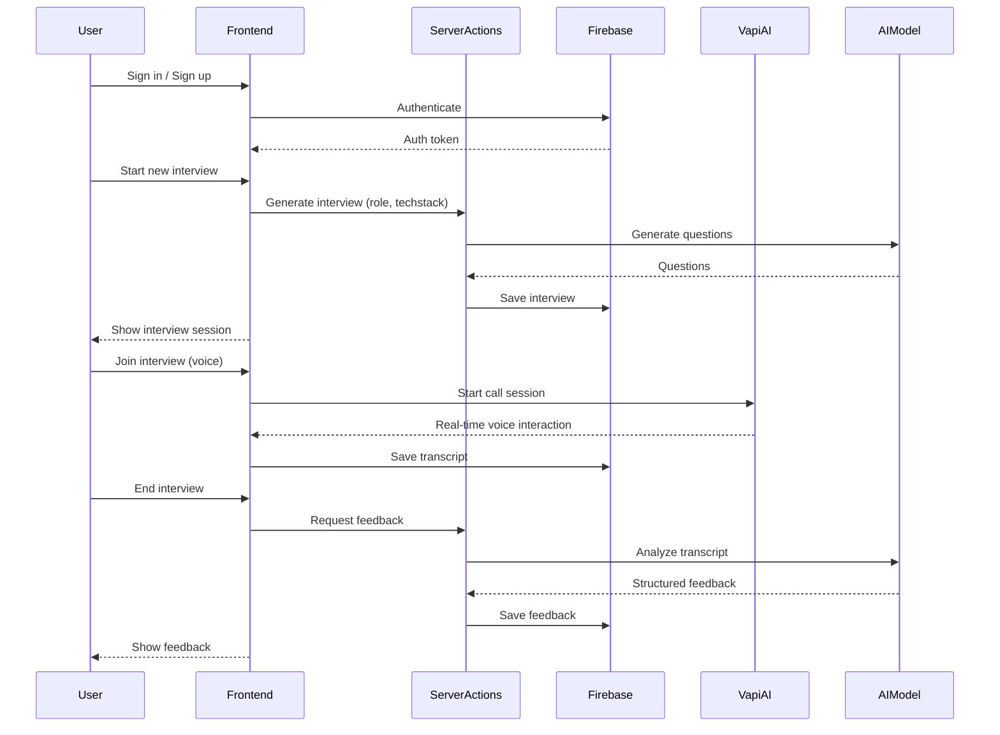

# Project Flow: PrepWise

PrepWise is an AI-powered platform for preparing for mock interviews. It enables users to practice interviews in real time with an AI interviewer, receive feedback, and track their progress. The system leverages Next.js, Firebase, and AI services (Google Gemini, OpenAI, Vapi AI) to deliver seamless, interactive interview experiences.

## High-Level Architecture

- **Frontend:** Built with Next.js and React, using Tailwind CSS for styling.
- **Backend:** Uses Firebase (Firestore for data, Auth for authentication) and server actions in Next.js.
- **AI Services:** Integrates with Vapi AI for real-time voice interviews and Google/OpenAI for feedback generation.

## Main Features & Flow

1. **Authentication:** Users sign up or log in (Firebase Auth).
2. **Dashboard:** Users see their past interviews and can start a new one.
3. **Interview Generation:**
   - User requests a new interview (role, tech stack, etc.).
   - AI generates interview questions.
   - User joins a real-time voice interview with the AI (via Vapi AI).
4. **Interview Session:**
   - User interacts (voice) with the AI interviewer.
   - Conversation is transcribed and stored.
5. **Feedback Generation:**
   - After the interview, the transcript is sent to an AI model (Google Gemini) for structured feedback (scores, strengths, areas for improvement).
   - Feedback is saved and shown to the user.
6. **Review & Retake:**
   - Users can review feedback and retake interviews.

## Key Components

- `app/(root)/page.tsx`: Dashboard/homepage, shows interviews.
- `app/(root)/interview/page.tsx`: Generates a new interview.
- `app/(root)/interview/[id]/page.tsx`: Displays a specific interview session.
- `app/(root)/interview/[id]/feedback/page.tsx`: Shows feedback for an interview.
- `components/Agent.tsx`: Handles real-time AI interview logic (call state, messaging, Vapi integration).
- `lib/actions/general.action.ts`: Server actions for fetching interviews, feedback, etc.
- `firebase/`: Firebase admin and client config.
- `constants/`: Interviewer prompt, dummy data, and config.

## Sequence Diagram

---

This document provides a high-level overview and sequence diagram for the PrepWise project. For more details, see the README or explore specific components in the codebase.
